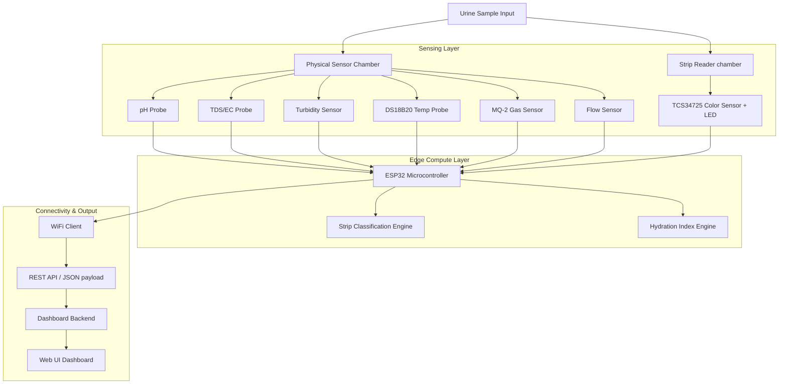

# Smart Urine Monitoring System

[](LICENSE)
[](https://www.espressif.com/en/products/socs/esp32)
[](#)

An open-source, IoT-enabled health screening platform designed to analyze physical and chemical urine parameters using physical sensors, gas sensing, and multi-spectral colorimetric analysis of standard 10-parameter reagent strips.

---

## Project Overview

The **Smart Urine Monitoring System** provides preliminary health screening and tracking capabilities. By combining traditional physical parameters (such as pH, Total Dissolved Solids, temperature, and turbidity) with automated electronic reading of a 10-parameter reagent strip, the system calculates hydration index, alerts for abnormal parameters, and transmits results to a local or cloud dashboard.

> [!WARNING]
> **Medical Disclaimer**: The Smart Urine Monitoring System is designed and intended for research, educational, and prototype development purposes only. It is **not** a certified medical diagnostic device and must not be used to replace professional medical diagnosis, treatment, or clinical decisions.

---

## Problem Statement

1. **Lack of Frequent Health Screening**: Most people only seek health analysis when symptomatic. Chronic metabolic, kidney, and urinary issues can develop silently over months or years.
2. **Access & Convenience**: Regular clinic visits for urinalysis are costly, time-consuming, and friction-filled, leading to low screening rates.
3. **Early Detection Opportunities**: Frequent, non-invasive urinalysis offers early detection signals for issues such as dehydration, Urinary Tract Infections (UTIs), early kidney disease progression, ketoacidosis risk, and glycosuria. Automating this at home changes proactive healthcare.

---

## System Architecture

The following diagram illustrates the flow of urine samples through the physical collection and sensing hardware, down to local processing and remote dashboard visualization.



---

## Sensor Table

The system integrates a suite of sensors to extract comprehensive biochemical and physical urine properties:

| Sensor Module | Target Parameter | Measurement Range / Output | Primary Purpose |
| :--- | :--- | :--- | :--- |
| **pH Sensor (Analog)** | Acidity / Alkalinity | 0.0 – 14.0 pH | Detects metabolic status, diet effects, or UTI indicators. |
| **TDS / EC Sensor** | Total Dissolved Solids | 0 – 2000 ppm / $\mu S/cm$ | Proxy for specific gravity; reflects solute concentrations. |
| **Turbidity Sensor** | Suspended Solids | 0 – 4000 NTU (0 - 5V) | Detects cloudiness indicating leukocytes, crystals, or blood. |
| **DS18B20 Temperature**| Liquid Temperature | -55°C to +125°C | Ensures sample is fresh (near 37°C) & calibrates TDS/pH. |
| **MQ-2 Gas Sensor** | Volatile Organics | Analog ppm curve | Screens for volatile odor compounds (e.g. ketone scent). |
| **Flow Sensor** | Sample Flow Rate | Pulse frequency | Computes total sample volume and ensures stable chamber fills. |
| **TCS34725 Colorimeter**| RGB & Clear Light | 16-bit I2C RGBC values | Reads standard 10-parameter urine strip color pads. |

---

## Key Features

* **Real-time Monitoring**: Instant reading of physical parameters (pH, temperature, turbidity, TDS) as the sample flows.
* **10-Parameter Urine Strip Analysis**: Automated optical analysis of standard reagent strips using a TCS34725 sensor under calibrated lighting, minimizing subjective human reading errors.
* **IoT & WiFi Connectivity**: Transmits structured telemetry payloads in JSON format over HTTP/HTTPS to server endpoints.
* **Research Data Logging**: Local serialization of raw sensor values to support calibration, datasets creation, and machine learning models.
* **Interactive Dashboard**: Premium, glassmorphism-styled dashboard showcasing real-time data, historical trends, and health warning flags.

---

## Hardware Assembly & Wiring

### ESP32 Pin Connections

Refer to the table below for standard wiring of the prototype:

| Component | Pin Type | ESP32 Pin | Details |
| :--- | :--- | :--- | :--- |
| **TCS34725 (Color)** | I2C SDA / SCL | GPIO 21 / GPIO 22 | Standard Wire interface |
| **pH Probe** | Analog Input | GPIO 32 (ADC1_CH4) | Requires voltage divider if using 5V module |
| **TDS Probe** | Analog Input | GPIO 35 (ADC1_CH7) | Requires calibration against standard EC solutions |
| **Turbidity Sensor** | Analog Input | GPIO 34 (ADC1_CH6) | Measures optical transmission |
| **DS18B20 Temp** | OneWire Bus | GPIO 4 | Requires $4.7\text{k}\Omega$ pullup resistor |
| **MQ-2 Gas Sensor** | Analog Input | GPIO 33 (ADC1_CH5) | Heated element, check current draw |
| **Flow Sensor** | Interrupt Input | GPIO 25 | Pulses per Liter calculation |
| **White LEDs (Light)**| Digital Output | GPIO 12 | PWM driver for optical chamber illumination |

For a complete breakdown of wiring, pull-up recommendations, and schematic design, review the [Hardware Design Guide](file:///c:/Users/UMESH%20PANDEY/OneDrive/Documents/Adobe/Smart-Urine-Monitoring-System/docs/hardware-design.md).

---

## Installation

### Prerequisites
1. Install [Arduino IDE](https://www.arduino.cc/en/software) or [PlatformIO Core](https://platformio.org/).
2. Install the ESP32 board support packages (v3.0.0+ recommended).
3. Install the following libraries via the Library Manager:
   * **Adafruit TCS34725**
   * **DallasTemperature** & **OneWire**
   * **ArduinoJson**

### Firmware Configuration
1. Open the [config.h](file:///c:/Users/UMESH%20PANDEY/OneDrive/Documents/Adobe/Smart-Urine-Monitoring-System/firmware/esp32/config.h) file.
2. Edit the WiFi credentials and Backend API URL:
   ```cpp
   #define WIFI_SSID "Your_SSID"
   #define WIFI_PASSWORD "Your_Password"
   #define BACKEND_API_URL "http://your-server-ip:3000/api/telemetry"
   ```
3. Flash the [main.ino](file:///c:/Users/UMESH%20PANDEY/OneDrive/Documents/Adobe/Smart-Urine-Monitoring-System/firmware/esp32/main.ino) file to your ESP32 module.

### Dashboard Setup
1. Navigate to the `dashboard/backend` folder:
   ```bash
   cd dashboard/backend
   npm install
   npm start
   ```
2. Open `dashboard/frontend/index.html` in your browser to view the visual UI.

---

## Future Scope

* **Machine Learning Classification**: Using neural network models to classify multivariate parameters and identify outliers.
* **Mobile Application**: Bluetooth Low Energy (BLE) integration for direct syncing with Android and iOS mobile health suites.
* **Smart Toilet Integration**: Mechanical designs for retrofitting the physical sample chamber directly into standard home toilet systems.
* **Multi-User Profiles**: Biometric or RFID identification to log data for multiple family members separately.
