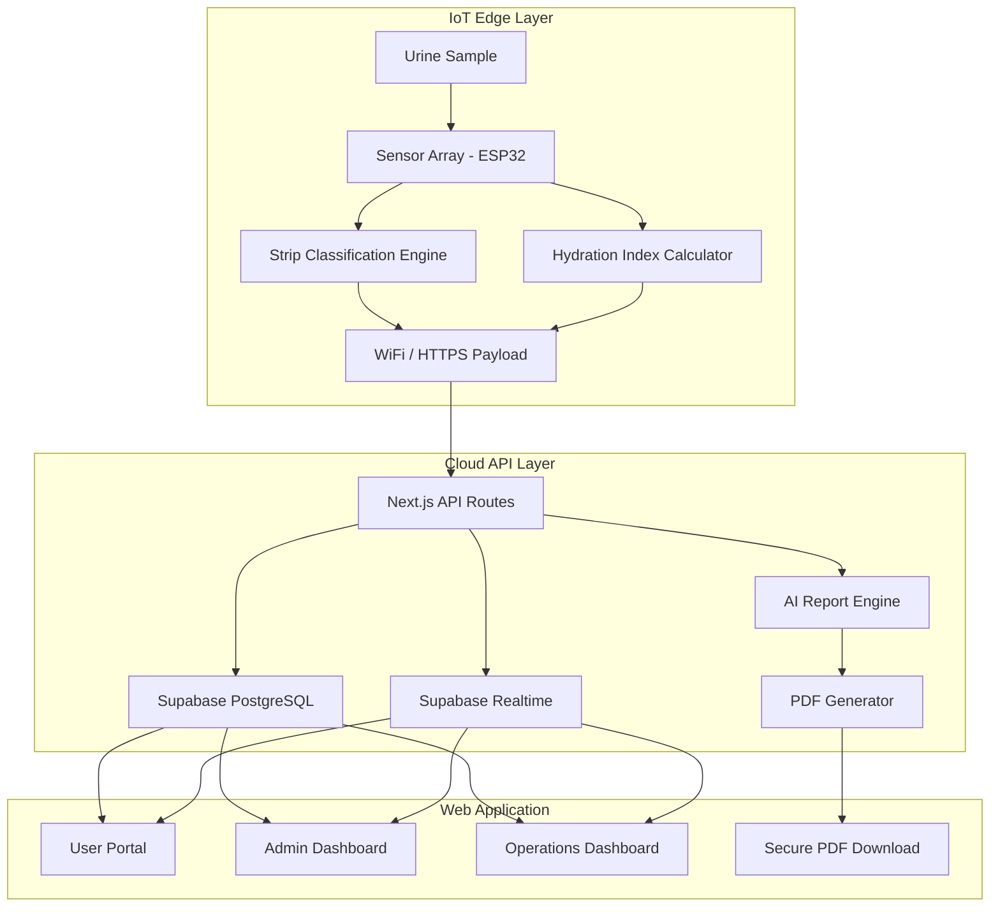

# UroSense

<div align="center">

**AI-Powered Smart Urine Health Monitoring Ecosystem**

[](LICENSE)
[](https://nextjs.org)
[](https://supabase.com)
[](https://typescriptlang.org)
[](https://www.espressif.com/en/products/socs/esp32)
[](#)
[](https://vercel.com)

[**Live Demo**](https://urosense.vercel.app) · [**Documentation**](docs/README.md) · [**Architecture**](docs/architecture/README.md) · [**API Reference**](docs/api/README.md)

</div>

---

> [!WARNING]
> **Medical Disclaimer**: UroSense is designed for research, educational, and prototype development purposes only. It is **not** a certified medical diagnostic device and must not be used to replace professional medical diagnosis, treatment, or clinical decisions.

---

## What is UroSense?

UroSense is a full-stack, AI-augmented health monitoring ecosystem that bridges **IoT sensor hardware** with a **cloud-native SaaS platform**. It transforms raw urinalysis data — captured by an ESP32-based sensor array — into actionable health insights delivered through a premium, multi-role web dashboard.

The system spans three architectural layers:

| Layer | Technology | Description |
| :--- | :--- | :--- |
| **Edge / IoT** | ESP32, Arduino | Physical sensors read pH, TDS, turbidity, color strips |
| **Cloud Platform** | Next.js 15, Supabase | Multi-tenant SaaS with RBAC, real-time telemetry, PDF reports |
| **AI Intelligence** | GPT-4o, OpenAI API | Natural language health summaries and anomaly detection |

---

## System Architecture



---

## Key Features

### 🏥 Multi-Role Platform
- **User Portal** — Personal health dashboard, report history, notifications
- **Admin Dashboard** — User management, device fleet, organization control
- **Operations Dashboard** — Device health monitoring, maintenance scheduling, alerts

### 📊 Smart Report Engine
- AI-generated health summaries powered by GPT-4o
- Cryptographically signed PDF reports with QR verification
- Automated anomaly detection and trend analysis

### ⚡ Real-Time Telemetry
- Live device status streaming via Supabase Realtime channels
- Push notifications for critical health parameter breaches
- Live dashboard updates without page refresh

### 🔒 Enterprise Security
- Row-Level Security (RLS) on all Supabase tables
- JWT-based OTP authentication
- Role-Based Access Control (RBAC): `patient` | `admin` | `operator`
- Audit logging for all sensitive operations

### 🌐 IoT Hardware Integration
- ESP32 microcontroller with 7-sensor array
- 10-parameter reagent strip optical analysis (TCS34725)
- WiFi telemetry with auto-reconnect and offline buffering

---

## Project Structure

```
Smart-Urine-Monitoring-System/
├── src/                          # Next.js 15 App Router
│   ├── app/
│   │   ├── (auth)/               # Login, OTP verification
│   │   ├── (portal)/             # User health portal
│   │   ├── (admin)/admin/        # Admin management routes
│   │   └── (operations)/operations/  # Ops monitoring routes
│   ├── components/               # Reusable UI components
│   ├── lib/                      # Auth, Supabase clients, utilities
│   └── types/                    # TypeScript type definitions
├── firmware/
│   └── esp32/                    # Arduino firmware source
├── hardware/                     # Schematics, BOM, CAD files
├── dashboard/                    # Legacy HTML prototype dashboard
├── docs/                         # Full documentation suite
│   ├── architecture/             # Phase architecture documents
│   ├── api/                      # API reference
│   ├── hardware/                 # Hardware design guides
│   └── deployment/               # Deployment & DevOps guides
├── tests/                        # Playwright E2E + Vitest unit tests
├── scripts/                      # DB migrations, seeders, backup tools
├── monitoring/                   # Prometheus + Grafana configuration
├── datasets/                     # Calibration and research datasets
└── .github/                      # CI/CD workflows, issue templates
```

---

## Sensor Hardware

The IoT edge layer integrates a 7-sensor array for comprehensive urinalysis:

| Sensor | Parameter | Range | Purpose |
| :--- | :--- | :--- | :--- |
| **pH Probe** | Acidity / Alkalinity | 0–14 pH | Metabolic status, UTI indicators |
| **TDS / EC Sensor** | Total Dissolved Solids | 0–2000 ppm | Solute concentration proxy |
| **Turbidity Sensor** | Suspended Solids | 0–4000 NTU | Leukocytes, crystals, blood detection |
| **DS18B20** | Temperature | -55°C to +125°C | Sample freshness, calibration |
| **MQ-2 Gas Sensor** | Volatile Organics | ppm analog | Ketone and VOC screening |
| **Flow Sensor** | Sample Volume | Pulse/L | Chamber fill verification |
| **TCS34725 Colorimeter** | RGB + Clear | 16-bit I2C | 10-parameter strip optical reading |

---

## Getting Started

### Prerequisites

- Node.js 20+, npm 10+
- Supabase account (free tier works)
- OpenAI API key (for AI report generation)
- Arduino IDE or PlatformIO (for firmware)

### 1. Clone & Install

```bash
git clone https://github.com/umeshpandeysh/Smart-Urine-Monitoring-System.git
cd Smart-Urine-Monitoring-System
npm install
```

### 2. Environment Configuration

```bash
cp .env.example .env.local
```

Fill in your Supabase and OpenAI credentials. See [`.env.example`](.env.example) for all required variables.

### 3. Database Setup

```bash
# Run Supabase migrations
npx supabase db push

# Seed demo data (optional)
npx tsx scripts/seed-demo-data.ts
```

### 4. Development Server

```bash
npm run dev
# Open http://localhost:3000
```

### 5. Firmware (ESP32)

1. Open [`firmware/esp32/config.h`](firmware/esp32/config.h) and set your WiFi credentials and API URL.
2. Flash [`firmware/esp32/main.ino`](firmware/esp32/main.ino) to your ESP32 via Arduino IDE or PlatformIO.

---

## Authentication & Demo Accounts

UroSense uses Supabase OTP (magic link / SMS) authentication. For local development with demo data seeded:

| Role | Email | Access |
| :--- | :--- | :--- |
| **Patient** | `patient@demo.urosense.dev` | User Portal |
| **Admin** | `admin@demo.urosense.dev` | Admin Dashboard |
| **Operator** | `operator@demo.urosense.dev` | Operations Dashboard |

---

## Testing

```bash
# Unit + Integration tests (Vitest)
npm run test

# E2E tests (Playwright)
npm run test:e2e

# Type checking
npm run type-check

# Linting
npm run lint
```

---

## Deployment

UroSense is designed for Vercel + Supabase production deployment. See the [Deployment Guide](docs/deployment/README.md) for full instructions including:

- Vercel project setup and environment secrets
- Supabase production configuration
- Docker alternative deployment
- CI/CD pipeline via GitHub Actions
- Monitoring with Prometheus + Grafana

---

## Documentation

| Document | Description |
| :--- | :--- |
| [Architecture Overview](docs/architecture/README.md) | Full system architecture across all phases |
| [API Reference](docs/api/README.md) | REST API endpoints and Supabase schema |
| [Hardware Design Guide](docs/hardware/hardware-design.md) | ESP32 wiring, schematics, BOM |
| [Deployment Guide](docs/deployment/README.md) | Production deployment instructions |
| [Contributing Guide](CONTRIBUTING.md) | How to contribute to this project |
| [Security Policy](SECURITY.md) | Vulnerability reporting and security practices |
| [Changelog](CHANGELOG.md) | Version history and release notes |

---

## Roadmap

- [ ] **v2.1** — Mobile app (React Native) with BLE ESP32 pairing
- [ ] **v2.2** — ML anomaly detection model (on-device TensorFlow Lite)
- [ ] **v2.3** — Smart toilet integration mechanical kit
- [ ] **v2.4** — Multi-user household profiles with RFID identification
- [ ] **v3.0** — Clinical-grade certification pathway and regulatory compliance module

---

## Contributing

Contributions are welcome! Please read the [Contributing Guide](CONTRIBUTING.md) before opening a pull request. For bugs or feature requests, use the [GitHub Issues](https://github.com/umeshpandeysh/Smart-Urine-Monitoring-System/issues) tracker.

---

## License

Distributed under the MIT License. See [LICENSE](LICENSE) for more information.

---

<div align="center">

Built with ❤️ by [umeshpandeysh](https://github.com/umeshpandeysh)

**UroSense** — Proactive Health Intelligence, Powered by Data

</div>
