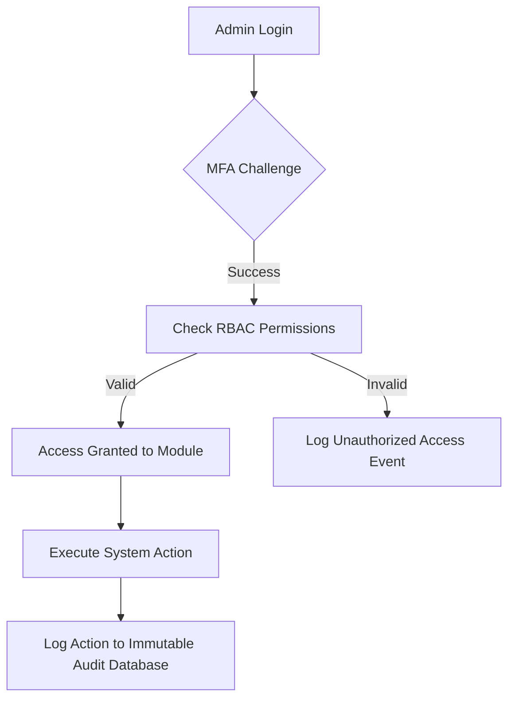

# UroSense Admin Dashboard Architecture
*Version 1.0.0 — Series A Platform Operations Specification*

## Executive Summary
This document defines the complete UI Architecture, Security Policies, Navigation Systems, and Operational Workflows for the **UroSense Admin Dashboard**. 

Drawing design inspiration from the Stripe Admin Dashboard, the AWS Management Console, Datadog, Linear, and Vercel, the Admin Dashboard is the centralized operations command center for the UroSense ecosystem. It manages users, physical IoT devices, municipal locations, clinical reports, edge machine learning models, notifications, and research datasets while maintaining strict security (HIPAA, SOC 2, GDPR).

---

# Admin Dashboard Architecture

## 1. Dashboard Purpose
The UroSense Admin Dashboard provides system administrators, operations engineers, public health authorities, and enterprise managers with the operational tools required to manage, monitor, and scale the UroSense network.

---

## 2. User Roles
The platform defines four major administrative personas:
- **Global Administrator (Platform Owner)**: Has unrestricted access to all settings, system configurations, billing details, and audit logs.
- **Operations Engineer (Hardware/Fleet Manager)**: Focuses on device provisioning, monitoring telemetry health, scheduling repairs, and deploying firmware.
- **Public Health Officer (Clinical Analyst)**: Analyzes aggregated wellness reports and configures public health alert policies.
- **Compliance Officer (Privacy/Legal Auditor)**: Manages research requests, audit logs, and compliance verification tasks.

---

## 3. Permission Hierarchy
Permissions are organized under a strict **Role-Based Access Control (RBAC)** model, mapped to functional areas:
- `global:write` | `global:read` — Absolute system control.
- `devices:write` | `devices:read` — Provisioning and diagnostics controls.
- `health_data:read` — Restricted access to clinical telemetry (locked behind dual-authorization policies).
- `security:read` — Access to audit trails and security event logs.

---

## 4. Navigation Structure
- **Global Context Selector**: Located at the top of the left sidebar, allowing administrators to toggle view contexts between `Global System`, `Airport Operations`, `Municipal Networks`, or specific `Enterprise Campuses`.
- **Command Sidebar**:
  - `Command Center` (Executive Overview)
  - `Directory` (User Profiles & Consent Logs)
  - `IoT Fleet` (Device Registry & Diagnostics)
  - `Locations` (Infrastructure Map)
  - `Reports` (Urinalysis database & verification keys)
  - `Analytics` (Platform usage & data volumes)
  - `AI Engine` (Model registry & performance monitoring)
  - `Alerts & Policies` (Notification templates & thresholds)
  - `Research & Data` (Data exports & governance logs)
  - `Security & Logs` (Audit trails & active access logs)
- **Top Utility Bar**: Houses the global database search input (hotkey `/`), system status indicators, and the admin profile toggle.

---

## 5. Information Architecture
The dashboard uses a layout designed for dense information displays, similar to Stripe and Datadog. It features left-aligned vertical tabs, nested sub-sections, sticky detail panels, and keyboard shortcuts to help power users navigate complex data grids.

---

## 6. Operational Workflows
1. **Device Provisioning Workflow**: An operations engineer scans a new IoT node's barcode, selects a location, assigns a firmware profile, runs an automated color calibration check, and registers the device.
2. **Clinical Alert Intervention**: When an extreme health anomaly is detected in a cohort, a Public Health Officer is alerted, reviews anonymized trend lines, and broadcasts a regional notification.
3. **Data Access Audit**: When a researcher requests a data export, a Compliance Officer reviews the request, generates an audit token, exports the anonymized dataset, and logs the action in the immutable audit trail.

---

# Operational Modules

## Module 1: Executive Command Center

### Purpose
Provides a real-time overview of the system's performance, location status, and active alerts.

### Components
- **System Health Monitor**: A grid displaying live statuses for the UroSense Cloud, API Gateways, Edge Ingestion pipelines, and Database clusters.
- **Fleet Uptime Chart**: A Datadog-style time-series graph tracking online vs offline IoT nodes.
- **Real-Time Screening Counter**: A high-impact numeric counter showing total analyses run today.
- **Urgent Incident Panel**: A list highlighting active hardware failures or clinical range anomalies.

### User Actions
- Trigger a global status broadcast.
- Toggle between live status graphs and historical comparison charts.

### Data Requirements
- Endpoint: `/api/v1/admin/command-center`
- Payload: Database status, API latency metrics, active location counts, daily usage numbers, and active incident lists.

### Loading States
Skeleton shimmer blocks over health indicator circles and telemetry charts.

### Empty States
Not applicable (defaults to a live system view).

### Error States
Displays a screen overlay: "Operational connection failure. Unable to sync command center metrics. [Reconnect]"

---

## Module 2: User Management

### Purpose
Allows administrators to manage user accounts, review consent logs, and audit data access permissions.

### Components
- **User Directory**: A dense, searchable data table displaying user IDs, verification statuses, consent dates, and connected health integrations.
- **Consent Audit Panel**: A detailed view showing signed HIPAA/GDPR consent forms and privacy preferences.
- **Access Control Panel**: Toggle switches to update user account locks and active roles.

### User Actions
- Lock/Unlock accounts.
- Audit a user's data access logs.
- Export a user's personal data file to fulfill data portability requests.

### Data Requirements
- Endpoint: `/api/v1/admin/users`
- Query Params: `query`, `status`, `consent_type`, `page`.

### Loading States
Row-by-row table skeleton animation with inline loading spinners for status toggles.

### Empty States
Displays: "No user profiles match your search parameters."

### Error States
Displays a table error banner: "Directory database query timed out."

---

## Module 3: Device Management

### Purpose
Allows operations teams to monitor, calibrate, update, and manage the IoT hardware fleet.

### Components
- **Device Registry Grid**: A grid of active devices showing hardware statuses, battery levels, RSSI metrics, and reagent cartridge levels (0-100%).
- **Firmware Console**: A tool to manage firmware images, track active versions, and schedule OTA (Over-the-Air) updates.
- **Diagnostics Terminal**: A console displaying live logs from selected ESP32 nodes (e.g., optical readings, calibration offsets).

### User Actions
- Trigger a remote calibration cycle.
- Deploy a firmware update to selected device cohorts.
- Flag a device for physical maintenance.

### Data Requirements
- Endpoint: `/api/v1/admin/devices`
- WebSockets: `wss://api.urosense.com/v1/admin/devices/logs` for real-time diagnostic feeds.

### Loading States
Glow animations over status indicators, with placeholder rows in log lists.

### Empty States
Displays: "No hardware devices registered in the selected location sector."

### Error States
Displays: "Device connection failure. Unable to pull registry status."

---

## Module 4: Location Management

### Purpose
Manages geographic placement metadata and installation blueprints across different sectors.

### Components
- **Geographic Sector Map**: An interactive map displaying active deployments in airport terminals, university campuses, and municipal grids.
- **Floor Plan Blueprint Viewer**: An overlay showing specific kiosk coordinates and plumbing configurations.
- **Maintenance Schedule Timeline**: A Gantt-style timeline showing scheduled location inspections.

### User Actions
- Register a new deployment location.
- Upload CAD maps and floor plan blueprints.
- Assign local field technicians to a sector.

### Data Requirements
- Endpoint: `/api/v1/admin/locations`
- Payload: Spatial coordinates, installation dates, contact details, and floor plan images.

### Loading States
Displays a map loading spinner, with skeleton blocks over metadata cards.

### Empty States
Displays: "No location profiles found. [Add New Location]"

### Error States
Displays: "Location database connection failed."

---

## Module 5: Report Management

### Purpose
Provides access to all laboratory-grade urinalysis reports, supporting clinical audits and data verification.

### Components
- **Report Database Grid**: A table listing reports by timestamp, anonymized cohort tags, pH, Specific Gravity, and flag status.
- **Cryptographic Signature Verification Panel**: A tool to verify the authenticity of a report using public key signatures.
- **Clinical Trend Analyzer**: A chart showing data distributions for specific report cohorts.

### User Actions
- Verify a report's cryptographic signature.
- Generate secure clinical export links.
- Flag anomalous results for verification checks.

### Data Requirements
- Endpoint: `/api/v1/admin/reports`
- Payload: Anonymized report parameters, calibration logs, and verification signatures.

### Loading States
Table rows display skeleton shimmers during database queries.

### Empty States
Displays: "No reports found matching the selected parameters."

### Error States
Displays: "Unable to retrieve clinical reports database."

---

## Module 6: Analytics Center

### Purpose
Monitors platform usage trends, dataset growth, and population wellness metrics.

### Components
- **Platform Usage Trend Line**: An area chart displaying daily, weekly, and monthly active screenings.
- **Data Volume Gauge**: A visualization showing total dataset storage sizes and database read/write speeds.
- **Biometric Distribution Chart**: A histogram showing the distribution of pH and specific gravity scores across populations.

### User Actions
- Export analytical charts to PDF or SVG formats.
- Customize cohort comparison parameters.

### Data Requirements
- Endpoint: `/api/v1/admin/analytics`
- Payload: Aggregated usage statistics and time-series data logs.

### Loading States
Displays loading animations inside the chart frames.

### Empty States
Displays: "No analytical data available for the selected parameters."

### Error States
Displays: "Data fetch timeout. Unable to render charts."

---

## Module 7: AI Management

### Purpose
Manages machine learning models used for edge classification and anomaly detection.

### Components
- **Model Registry Table**: A list of deployed TensorFlow Lite models, displaying versions, deployment targets, and accuracy scores.
- **Performance Matrix**: A dashboard tracking true positive/false positive rates, training loss, and edge CPU latencies.
- **Validation History Log**: A log recording diagnostic tests run against reference datasets.

### User Actions
- Deploy a model version to edge cohorts.
- Trigger model validation routines against test datasets.
- Roll back a model version in case of performance drops.

### Data Requirements
- Endpoint: `/api/v1/admin/ai-models`
- Payload: Model files, performance metrics, and validation logs.

### Loading States
Displays progress indicators during model validation runs.

### Empty States
Displays: "No machine learning models registered. [Upload Model]"

### Error States
Displays: "Model registry database unreachable."

---

## Module 8: Notification Management

### Purpose
Allows administrators to design templates, configure alert thresholds, and monitor notification delivery.

### Components
- **Template Designer Editor**: A WYSIWYG editor to create and edit SMS, Email, and Push notifications.
- **Delivery Log Queue**: A list displaying sent messages, delivery success rates, and open rates.
- **Alert Policy Editor**: A interface to configure automated notification triggers based on health parameters or device statuses.

### User Actions
- Publish notification templates.
- Update global alert triggers and notification policies.
- Resend failed notifications.

### Data Requirements
- Endpoint: `/api/v1/admin/notifications`
- Payload: Notification templates, system log entries, and alert policies.

### Loading States
Displays spinners during template saving and log searches.

### Empty States
Displays: "No alert templates configured. [Create Template]"

### Error States
Displays: "Template engine offline."

---

## Module 9: Research & Data Governance

### Purpose
Manages research access requests, exports anonymized datasets, and audits data sharing compliance.

### Components
- **Access Request Table**: A queue of requests from research institutions, displaying applicant details and proposed use cases.
- **Export Configuration Panel**: A tool to define dataset variables, timeframe ranges, and anonymization settings.
- **Compliance Compliance Monitor**: A dashboard tracking data sharing terms, access expiration times, and usage limits.

### User Actions
- Approve data export requests.
- Generate secure data download packages.
- Revoke expired API tokens.

### Data Requirements
- Endpoint: `/api/v1/admin/research`
- Payload: Data sharing logs, export configurations, and token databases.

### Loading States
Displays circular progress indicators during export generation.

### Empty States
Displays: "No pending data access requests."

### Error States
Displays: "Compliance validation timeout."

---

## Module 10: Security Operations

### Purpose
Tracks system access logs, reviews audit trails, and monitors security incidents.

### Components
- **Audit Log Table**: An immutable log recording administrative actions, display adjustments, and data exports.
- **Access Log Monitor**: A geographic map showing active admin logins by location, IP, and authentication status.
- **Security Event Feed**: A real-time log of security events (e.g., rate-limit triggers, brute-force attempts, unauthorized access).

### User Actions
- Export audit logs to secure storage.
- Terminate active administrative sessions.
- Trigger security lockdown modes in response to threat alerts.

### Data Requirements
- Endpoint: `/api/v1/admin/security`
- Payload: Audit logs, active sessions list, and security events database.

### Loading States
Row-by-row table skeleton shimmers during access queries.

### Empty States
Displays: "Zero security threats or unauthorized access attempts detected."

### Error States
Displays: "Audit database connection failure. [Retry]"

---

# Strategic Architecture & Frameworks

## RBAC Framework
Permissions are enforced using an administrative authorization matrix:
```
+-----------------------------------+
|  Role             | Permissions   |
+-----------------------------------+
|  Global Admin     | *             |
+-----------------------------------+
|  Operations Eng   | device:*      |
|                   | firmware:*    |
+-----------------------------------+
|  Health Officer   | health:read   |
|                   | alert:write   |
+-----------------------------------+
|  Compliance Off   | audit:read    |
|                   | export:write  |
+-----------------------------------+
```

---

## Audit Framework
All write actions on the platform trigger an audit event:
$$\text{Audit Event} = \{ \text{Timestamp}, \text{Admin ID}, \text{IP Address}, \text{Action Type}, \text{Affected Resource}, \text{Resource Delta} \}$$
Audit logs are stored in a read-only table and archived in secure, WORM (Write Once, Read Many) cloud storage to prevent modifications.

---

## Governance Framework
- **De-identification Verification**: Datasets must undergo automated checks (e.g., removing timestamps and zip codes) to confirm compliance with HIPAA Safe Harbor standards before export.
- **Access Expiration**: Administrative tokens expire after 1 hour of inactivity, requiring re-authentication.

---

## Admin Workflow Architecture


---

## Security & Compliance Architecture
- **Dual-Authorization Controls**: Critical actions (such as exporting datasets or updating model registries) require approval from two administrators before execution.
- **Data Protection**: Telemetry data is encrypted at rest (AES-256) and in transit (TLS 1.3). Database keys are managed using automated rotation systems (KMS).
