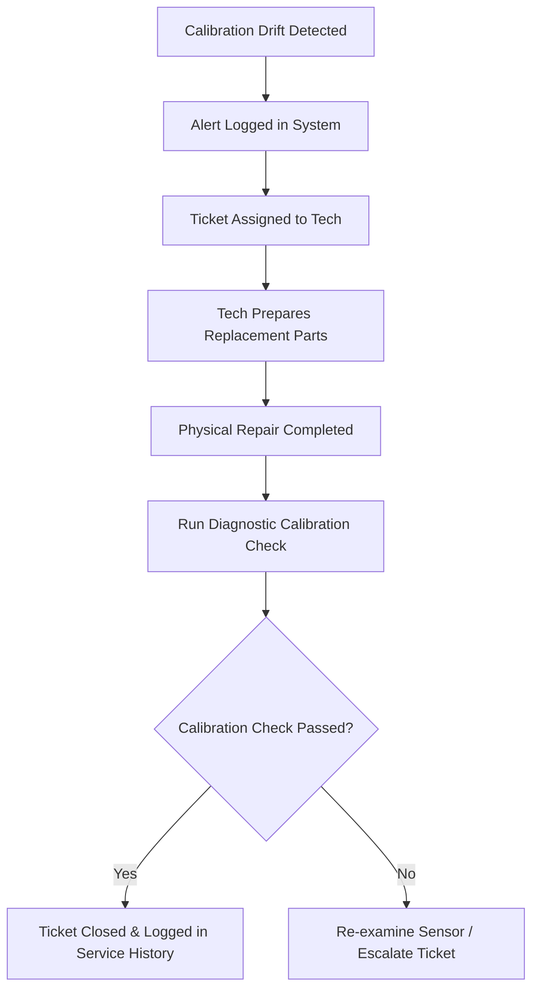

# UroSense Location & Device Operations Dashboard Architecture
*Version 1.0.0 — Series A Infrastructure Operations Specification*

## Executive Summary
This document establishes the UI Architecture, Navigation, Data Requirements, and Workflows for the **UroSense Location & Device Operations Dashboard**. 

Designed for local operations and maintenance teams (e.g., airport terminal managers, hospital facilities engineers, smart restroom coordinators, university campus maintenance teams), this dashboard draws design inspiration from Datadog Infrastructure Monitoring, AWS CloudWatch, Stripe Operations Console, and modern Smart City Operations Centers. It provides local fleet visibility, real-time telemetry checks, proactive maintenance calendars, and sensor calibration diagnostics, restricted specifically to the operator's assigned physical sites.

---

# Location Operations Dashboard Architecture

## 1. Dashboard Purpose
The dashboard serves as the local operations center. It is designed to maximize hardware uptime, ensure sensor calibration accuracy, schedule physical maintenance visits, and track spare parts logs across specific assigned regions (e.g., Terminal 2 North, main campus sector).

---

## 2. User Roles
- **Local Facility Manager (Operations Supervisor)**: Monitors overall site metrics, reviews SLA compliance, and approves maintenance tasks.
- **Maintenance Technician**: Responds to sensor alerts, replaces reagent cartridges, cleans optical pathways, and records component changes.
- **Network / Support Administrator**: Monitors network link quality, runs remote calibration tasks, and troubleshoots firmware updates.

---

## 3. Permission Structure
The dashboard uses a **Location-Scoped RBAC Model** to enforce security:
- Operators only see data for sites assigned to their tenant IDs (e.g., an airport technician cannot access university campus diagnostics).
- *Permissions Matrix*:
  - `tenant:read` — Access to local dashboards and reports.
  - `devices:calibrate` — Trigger remote sensor calibration checks.
  - `maintenance:write` — Create and close maintenance tickets.

---

## 4. Navigation Architecture
- **Location Scope Selector**: A dropdown menu in the top bar to filter views by assigned zones (e.g., Restroom A, B, or C).
- **Navigation Options**:
  - `Overview` (Real-time site health metrics)
  - `Device Monitor` (Device registry & sensor states)
  - `Location Analytics` (Usage and peak hour metrics)
  - `Maintenance Hub` (Schedules, spare parts, and tickets)
  - `Incidents & Alerts` (Active alerts queue)
  - `Diagnostics Tool` (Calibration checks and real-time logs)
  - `Reports Console` (SLA and operational logs export)
  - `Deployment Planner` (Device configuration and capacity settings)

---

## 5. Operational Workflow
- **Detection**: A sensor reports calibration drift (e.g., pH sensor offset exceeding thresholds).
- **Notification**: The dashboard registers an incident, flags it in the alert queue, and sends a push notification to the technician on duty.
- **Intervention**: The technician reviews diagnostics on their mobile device, picks up spare parts (e.g., replacement pH probes), performs the physical repair, runs a calibration scan, and closes the ticket.
- **Log Verification**: The system verifies the new calibration readings and logs the repair details in the device's service history.

---

# Operations Modules

## Module 1: Operations Overview

### Purpose
Provides a quick summary of the operational health, usage metrics, and active incidents for the assigned locations.

### Components
- **Site Uptime Meter**: Displays the percentage of online devices (e.g., 99.8% uptime target).
- **Active Alerts Indicator**: Highlights critical hardware failures requiring immediate attention.
- **Daily Scan Counter**: A chart showing hourly usage trends.
- **Open Incidents List**: A log of active service requests sorted by priority.

### Data Requirements
- Endpoint: `/api/v1/ops/overview` (Refreshes every 10 seconds via WebSockets).
- Payload: Active device counts, daily usage, maintenance statuses, and alert queues.

### User Actions
- Tap incident rows to open detail panels.
- Toggle between active and archived alerts.

### Drill-down Behavior
Clicking the Uptime Meter redirects to the Device Monitoring Center, pre-filtered to show offline devices.

### Loading States
Skeleton shimmer cards over metrics and tables.

### Empty States
Displays: "All devices online. No active incidents reported."

### Error States
Displays: "Failed to connect to the operations API gateway. [Reconnect]"

---

## Module 2: Device Monitoring Center

### Purpose
Lists all physical IoT nodes within the assigned sector, showing real-time network and sensor metrics.

### Components
- **Device Registry Table**: Displays Device IDs, location tags, online/offline statuses, battery levels, signal strength (RSSI), and cartridge statuses (0-100%).
- **Firmware Status Tracker**: Highlights nodes running outdated firmware versions or experiencing update loops.

### Data Requirements
- Endpoint: `/api/v1/ops/devices`
- Query Params: `status`, `sensor_health`, `firmware_version`.

### User Actions
- Filter devices by status or cartridge level.
- Trigger remote device reboots.
- Assign device profiles to update groups.

### Drill-down Behavior
Clicking a device row opens the Device Diagnostics interface for real-time testing.

### Loading States
Shimmering placeholder rows in the registry table.

### Empty States
Displays: "No registered hardware nodes found in this sector. [Register Device]"

### Error States
Displays: "Unable to retrieve device registry records."

---

## Module 3: Location Analytics

### Purpose
Analyzes restroom traffic, peak usage times, and device utilization rates to optimize cleaning schedules.

### Components
- **Peak Hours Heatmap**: A visualization showing usage density by day and hour.
- **Device Utilization Chart**: A bar graph comparing scan rates across different restrooms.
- **Traffic Forecasting Indicator**: A predictive chart forecasting tomorrow's utilization based on historical trends.

### Data Requirements
- Endpoint: `/api/v1/ops/analytics`
- Payload: Hourly usage arrays, device scan distributions, and prediction vectors.

### User Actions
- Toggle chart timelines (Today, 7D, 30D).
- Export location analytics reports as CSV datasets.

### Drill-down Behavior
Clicking a peak hour block opens a view showing device utilization rates for that period.

### Loading States
Renders empty chart coordinates with a centered loader.

### Empty States
Displays: "Not enough traffic data to calculate utilization trends."

### Error States
Displays: "Failed to load location traffic analytics."

---

## Module 4: Maintenance Center

### Purpose
Manages scheduled maintenance visits, calibration cycles, spare parts inventories, and repair histories.

### Components
- **Service Request Queue**: A list of open maintenance tickets.
- **Maintenance Calendar**: A calendar displaying scheduled cartridge swaps, sensor cleanings, and system tests.
- **Spare Parts Inventory Grid**: Tracks available inventories for reagent cartridges, pH probes, and color sensors.

### Data Requirements
- Endpoint: `/api/v1/ops/maintenance`
- Payload: Scheduled tickets list, calendar entries, and parts inventory counts.

### User Actions
- Schedule maintenance windows.
- Create manual service requests.
- Update spare parts inventory counts.

### Drill-down Behavior
Clicking a service request opens the ticket details page, showing device diagnostics and parts lists.

### Loading States
Displays a calendar skeleton loader, with shimmers over database grids.

### Empty States
Displays: "All maintenance tasks completed. No open service requests."

### Error States
Displays: "Maintenance database connection timeout."

---

## Module 5: Incident Management

### Purpose
Tracks system errors, communication dropouts, and hardware failures, managing resolutions via structured escalations.

### Components
- **Active Incident Queue**: A list of incidents sorted by severity (Critical, High, Medium, Low).
- **Incident Progress Timeline**: A history log showing when an incident was detected, assigned, and resolved.

### Data Requirements
- Endpoint: `/api/v1/ops/incidents`
- WebSockets: Real-time incident updates.

### User Actions
- Assign tickets to on-duty technicians.
- Escalate unresolved incidents to higher tiers.
- Add notes and photos to tickets.

### Drill-down Behavior
Clicking an incident row displays a diagnostic checklist for the affected device.

### Loading States
Displays pulsing indicators at the top of the card as updates stream in.

### Empty States
Displays a green checkmark: "No open incidents. System performing within normal limits."

### Error States
Displays: "Incident manager offline. [Reconnect]"

---

## Module 6: Device Diagnostics

### Purpose
Allows support teams to run sensor calibration routines and test hardware components remotely.

### Components
- **Real-Time Telemetry Feed**: A live graph displaying physical sensor outputs (TDS, pH, turbidity, temperature).
- **Component Test Panel**: Toggle controls to test RGB LEDs, motorized trays, and clean-and-flush cycles.
- **Calibration Verification Tool**: Compares sensor outputs against internal reference values to verify alignment.

### Data Requirements
- Endpoint: `/api/v1/ops/diagnostics/{id}`
- WebSockets: Real-time diagnostic log stream.

### User Actions
- Trigger a sensor self-test.
- Run a remote calibration routine.
- Clear calibration offset values.

### Drill-down Behavior
Tapping the calibration details opens historical calibration logs to trace sensor wear over time.

### Loading States
Displays a progress bar during remote diagnostic tests.

### Empty States
Displays: "Select a device to run diagnostics."

### Error States
Displays: "Diagnostic connection timeout. Verify the device is online."

---

## Module 7: Alerts & Notifications

### Purpose
Manages alert policies and configures notifications for system anomalies.

### Components
- **Alert Policy Editor**: A panel to define threshold values for alerts (e.g., pH variance > 1.5, cartridge level < 15%).
- **Notification Routing Table**: Connects alert categories to communication channels (Push, SMS, Email).

### Data Requirements
- Endpoint: `/api/v1/ops/alerts/policies`

### User Actions
- Customize threshold values for alerts.
- Toggle alert routes for on-duty technicians.

### Drill-down Behavior
Clicking an active alert policy opens historical data charts that show why the alert was triggered.

### Loading States
Displays loading spinners during policy updates.

### Empty States
Displays: "No custom alert policies defined. Using default settings."

### Error States
Displays: "Unable to update alert settings. [Retry]"

---

## Module 8: Operational Reports

### Purpose
Generates performance reports to confirm compliance with service level agreements (SLAs).

### Components
- **Report Template Cards**: Templates for weekly uptime reviews, monthly operations summaries, and calibration histories.
- **Export Progress Bar**: Tracks file generation progress.

### Data Requirements
- Endpoint: `/api/v1/ops/reports/generate`

### User Actions
- Select report templates and date ranges.
- Export reports as PDF documents or CSV datasets.

### Drill-down Behavior
Displays a PDF report preview within the dashboard interface.

### Loading States
Progress indicators animate during report compilation.

### Empty States
Displays: "No reports generated yet."

### Error States
Displays: "Report generation failed. Please check backend logs."

---

## Module 9: Deployment Management

### Purpose
Manages device registration, capacity settings, and configuration details for assigned locations.

### Components
- **Device Assignment Panel**: Allows adding newly installed devices to specific restrooms or layout zones.
- **Zone Configuration Form**: Set capacity limits, expected daily traffic, and cartridge refill thresholds.

### Data Requirements
- Endpoint: `/api/v1/ops/deployments`

### User Actions
- Register and configure new hardware nodes.
- Update expected usage settings.
- Group devices into zone profiles.

### Drill-down Behavior
Clicking a zone profile focuses the map on that sector, displaying details for all grouped devices.

### Loading States
Displays loading shimmers inside the configuration form.

### Empty States
Displays: "No zones defined. [Create Zone Profile]"

### Error States
Displays: "Failed to update configuration settings."

---

# Operational Frameworks & Workflows

## Maintenance Workflow

---

## Escalation Workflow
- **Level 1 (Technician on Duty)**: Notification sent via push and SMS. If unresolved in 4 hours, escalates.
- **Level 2 (Operations Supervisor)**: Notification sent via email. Supervisor can assign resources or flag the device as offline.
- **Level 3 (Platform Support Team)**: Handled by platform engineers who analyze logs to troubleshoot firmware or system issues.

---

## Device Lifecycle Management
1. **Provisioning**: Scan barcode, configure location, set network details, run initial calibration scan.
2. **Operational**: Monitor telemetry values, calibrate automatically, update firmware via OTA.
3. **Preventive Care**: Swap reagent cartridges, clean optical elements, and replace worn sensors based on schedules.
4. **Maintenance**: Respond to faults, replace parts, run calibration checks, record actions in logs.
5. **Decommissioning**: Wipe local settings, remove registry listings, recycle components.

---

## Operational KPI Framework
- **Mean Time to Repair (MTTR)**: Target average duration to resolve hardware faults: $< 2$ hours.
- **Sensor Drift Frequency**: Tracks how often calibration adjustments are needed per device.
- **Average Calibration Error**: Tracks calibration drift averages to measure sensor quality.

---

## Preventive Maintenance Framework
- **Cartridge Swaps**: Scheduled automatically based on remaining capacity (e.g., alert at 15%).
- **Optical System Checks**: Scheduled every 90 days to clean dust from internal sensors.
- **pH Probe Replacement**: Scheduled every 180 days due to degradation in liquid environments.

---

## Predictive Maintenance Strategy
The platform analyzes changes in calibration offsets and sensor outputs to predict component failures:
$$\text{Sensor Wear Factor} = \frac{\Delta \text{Calibration Offset}}{\Delta \text{Days in Service}} \times \text{Daily Scan Volume}$$
If the **Sensor Wear Factor** exceeds thresholds, the dashboard creates a preventative ticket to replace the sensor before a failure occurs.
