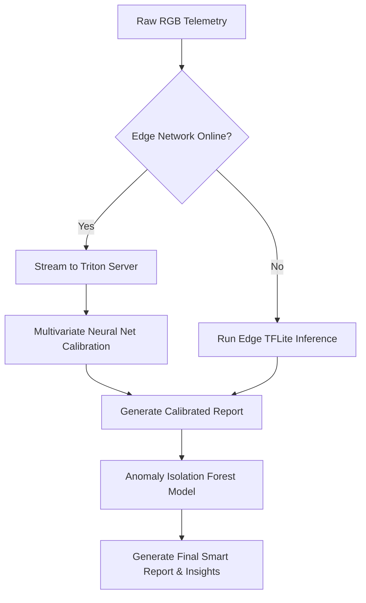

# UroSense Real-Time Infrastructure & Analytics Pipeline Architecture
*Version 1.0.0 — Series A Data Infrastructure Specification*

## Executive Summary
This document defines the complete system architecture, data flow pipelines, machine learning pipelines, and scalability profiles for the **UroSense Real-Time Infrastructure, Event Streaming, Analytics Pipeline, and AI Processing Architecture**. 

To support simultaneous screening telemetry across global transit networks (airports, railway stations), smart city grids, hospitals, and corporate campuses, this architecture is engineered for low latency, high availability, and data security. It covers telemetry ingestion, stream processing, edge-to-cloud AI classification, real-time alert routing, and privacy-first data storage layers.

---

# System Architecture Overview

UroSense uses a lambda-inspired hybrid stream-and-batch processing pipeline to handle thousands of simultaneous IoT data streams. The system is split into six key layers:

```
[IoT Node Network] ---> [Ingestion Layer] ---> [Event Streaming] ---> [AI & Stream Processing] ---> [Data Storage Tiers] ---> [API & Client Dashboards]
```

---

## 1. Ingestion Layer

### Purpose
Provides a secure entry point for real-time sensor data from ESP32 IoT nodes deployed worldwide.

### Architecture & Components
- **MQTT Broker Cluster (EMQX / AWS IoT Core)**: Deployed across regions to maintain persistent, low-power connections with IoT nodes via MQTT over TLS (port 8883).
- **HTTPS Telemetry Gateway (REST)**: Provides fallback HTTPS endpoints for nodes operating in restricted network environments.
- **Global Load Balancers (Anycast / Cloudflare)**: Routes node connections to the nearest regional ingestion cluster, minimizing network latency.
- **Edge API Gateway (Kong / Envoy)**: Validates client certificate signatures (mTLS), enforces rate limits, and decrypts payloads.

### Data Inputs
- Raw 10-parameter RGB sensor readings.
- Physical sensor telemetry (pH levels, turbidity voltages, temperature values, TDS analog signals).
- Device metadata (Device UUID, firmware version, calibration offsets).

---

## 2. Event Streaming Backbone

### Purpose
Provides a scalable, fault-tolerant message queue to distribute incoming telemetry streams to processing services.

### Architecture & Components
- **Apache Kafka / Redpanda Cluster**: Managed multi-node cluster serving as the central message bus.
- **Kafka Schema Registry**: Enforces data formats using Avro schemas to prevent corrupted telemetry payloads.
- **Topic Architecture & Partitioning**:
  - `telemetry.raw.v1`: Partitioned by `Device_UUID` to ensure telemetry from the same node is processed chronologically.
  - `alerts.infrastructure.v1`: Real-time system diagnostics and failure alerts.
  - `alerts.health.v1`: Anonymized alerts flagging physiological outliers.
  - `reports.generated.v1`: Completed clinical reports ready for distribution.

---

## 3. Real-Time Stream Analytics Pipeline

### Purpose
Calculates real-time statistics (e.g., active locations, usage volumes) and correlates health trends across regions.

### Architecture & Components
- **Apache Flink Stream Processor**: Processes data in real time, running continuous windows-based aggregations:
  - *Hourly Slidings*: Aggregates screening volumes per location sector.
  - *Daily Tumblings*: Computes anonymized population wellness scores.
- **Time-Series Database (TimescaleDB / InfluxDB)**: Stores aggregated telemetry indexes.
- **Cache Layer (Redis Enterprise)**: Caches real-time counters (e.g., "Analyses Today") to speed up dashboard queries.

---

## 4. AI & Machine Learning Processing Engine

### Purpose
Classifies reagent strip color values, detects anomalies, and generates personalized wellness insights.

### Architecture & Components
- **Edge Inference (TensorFlow Lite for Microcontrollers)**: Deployed directly on ESP32 nodes to run baseline classifications, ensuring offline screening capability.
- **Cloud Classification Worker (PyTorch / Triton Inference Server)**: Runs multivariate neural networks to analyze raw RGB inputs against reference color cards, correcting for lighting variations.
- **Anomaly Detection Service (Scikit-Learn / Isolation Forest)**: Analyzes incoming parameters against the user's historical baseline to flag sudden physiological changes.
- **MLOps Model Registry (MLflow)**: Manages model versioning, testing, and deployment to edge node cohorts.



---

## 5. Public Health and Infrastructure Alerting Engine

### Purpose
Routes urgent notifications to maintenance technicians or public health authorities based on system events.

### Architecture & Components
- **Flink Alert Router**: Evaluates streaming metrics against active system policies in real time.
- **Push Notification Service (Firebase Cloud Messaging / Apple APNS)**: Dispatches alerts to mobile portals and technician applications.
- **Siren / PagerDuty Gateways**: Integrates operational alerts directly into enterprise and municipal maintenance systems.

---

## 6. Data Storage & Archiving Tiers

### Purpose
Maintains compliance with data retention policies while optimizing storage costs.

### Storage Tiers
- **Hot Storage (TimescaleDB / Redis)**: Stores recent telemetry logs and active notifications (0-30 days).
- **Warm Storage (Amazon Aurora PostgreSQL)**: Stores anonymized historical trend indices and user portal metadata (31-365 days).
- **Cold Storage (Amazon S3 / Glacier with KMS)**: Stores signed clinical PDF reports and raw research datasets in encrypted, write-once storage (1+ years).

---

# Strategic Architecture Frameworks

## Operational KPI & Scaling Targets
- **Max Ingestion Throughput**: Up to 10,000 requests/sec.
- **Stream Processing Latency**: Ingestion-to-dashboards duration: $< 500\text{ ms}$.
- **Edge Inference Latency**: Local classification on ESP32: $< 1.2\text{ seconds}$.
- **Message Delivery SLA**: 99.999% success rate for critical alerts.

---

## Predictive Maintenance ML Pipeline
The platform uses anomaly detection algorithms to monitor physical sensor degradation:
- **Drift Calculation**: Tracks changes in calibration offsets over time:
  $$\text{Cal_Drift} = \frac{|V_{\text{current\_cal}} - V_{\text{baseline\_cal}}|}{V_{\text{baseline\_cal}}}$$
- **Failure Trigger**: If $\text{Cal_Drift} \ge 0.15$ over 3 consecutive cycles, the system creates a high-priority repair ticket.

---

## Real-Time Data Flow & Verification
1. **Payload Receipt**: The MQTT broker receives the telemetry payload from the node.
2. **Decryption & Validation**: The gateway checks the signature and publishes the payload to `telemetry.raw.v1`.
3. **AI Processing**: Triton Server runs the classification model, verifies the calibration check, and publishes metrics to `telemetry.processed.v1`.
4. **Stream Aggregation**: Apache Flink aggregates regional statistics and updates the Redis cache.
5. **Dashboard Sync**: WebSockets push the updated values to active client dashboards.
