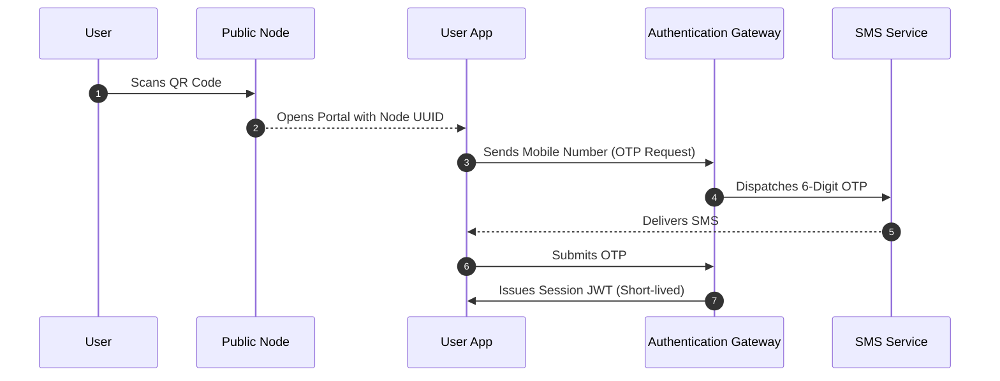
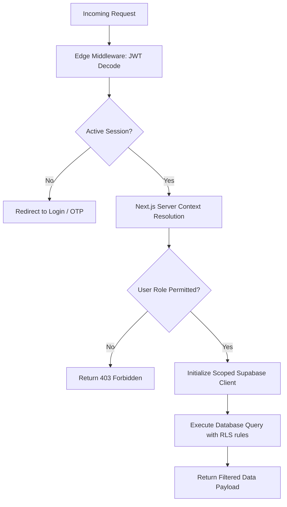
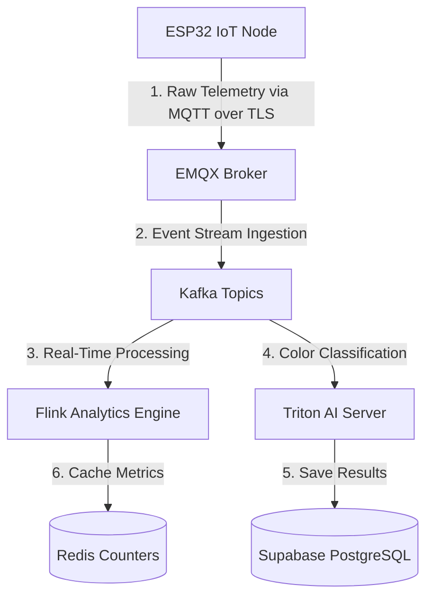
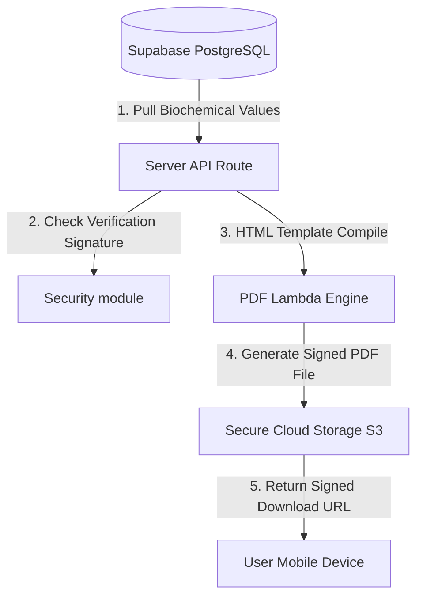

# Phase 13 — UroSense Implementation Foundation
*Version 1.0.0 — Series A Enterprise Platform Architecture & Codebase Design*

## Executive Summary
This document establishes the production-grade codebase structure, dependency manifest, security boundaries, and data flow pipelines for **UroSense**. Designed for Next.js 15, Supabase, and a real-time event streaming backend, this foundation supports multi-tenant smart city installations, airport fleet operations, and HIPAA/SOC 2 compliant medical diagnostic exports.

This phase defines the **Implementation Foundation** only. It does not contain frontend page code, UI designs, or database schemas.

---

# A. Final Implementation Folder Structure

```
urosense-platform/
├── .github/
│   └── workflows/
│       ├── build.yml
│       ├── deploy.yml
│       └── security-scan.yml
├── docs/
│   ├── api/
│   ├── deployment/
│   └── compliance/
├── supabase/
│   ├── migrations/
│   ├── seed.sql
│   └── config.toml
├── src/
│   ├── app/
│   │   ├── (auth)/
│   │   │   ├── login/
│   │   │   └── verify/
│   │   ├── (dashboard)/
│   │   │   ├── admin/
│   │   │   ├── operator/
│   │   │   └── user/
│   │   ├── api/
│   │   │   ├── v1/
│   │   │   │   ├── devices/
│   │   │   │   ├── reports/
│   │   │   │   └── telemetry/
│   │   │   └── auth/
│   │   ├── layout.tsx
│   │   └── page.tsx
│   ├── components/
│   │   ├── ui/             # ShadCN base components
│   │   ├── common/         # Layouts, Shells, Loaders
│   │   ├── charts/         # Recharts implementations
│   │   └── diagnostic/     # ReagentStripVisualizer, gauge elements
│   ├── config/
│   │   ├── env.ts          # Zod validated env loader
│   │   └── site.ts         # Navigation and layout metadata
│   ├── lib/
│   │   ├── supabase/       # Browser/Server Supabase clients
│   │   ├── auth/           # NextAuth/Supabase Auth utility wrappers
│   │   ├── telemetry/      # Event ingestion utilities
│   │   └── utils/          # Tailwind merger and formatting helpers
│   ├── services/
│   │   ├── ai.ts           # Triton/ML classification client
│   │   ├── reports.ts      # PDF generation client (Puppeteer wrapper)
│   │   ├── analytics.ts    # Time-series aggregation wrapper
│   │   └── notification.ts # Push/SMS dispatch router
│   ├── store/
│   │   ├── user.ts         # Zustand store for user profiles
│   │   └── device.ts       # Zustand store for active device streams
│   └── types/
│       ├── index.d.ts      # Global Typings
│       ├── database.types.ts # Auto-generated Supabase schema definitions
│       └── telemetry.ts    # Biometric parameter types
├── public/
│   ├── assets/
│   ├── static/
│   └── reports/
├── .env.example
├── .gitignore
├── eslint.config.js
├── tailwind.config.ts
├── tsconfig.json
├── package.json
└── README.md
```

---

# B. All Environment Variables
These environment variables are validated at runtime using a Zod schema (`src/config/env.ts`) to ensure the application fails immediately if configured incorrectly.

```bash
# ==============================================================================
# UroSense Enterprise Environment Variables Configuration
# ==============================================================================

# Core Node Environment
NODE_ENV="development" # production | staging | development
NEXT_PUBLIC_APP_URL="https://app.urosense.com"

# Next.js 15 Server Settings
PORT=3000
HOSTNAME="localhost"

# Supabase Configurations (Database & Auth Gateway)
NEXT_PUBLIC_SUPABASE_URL="https://your-project-id.supabase.co"
NEXT_PUBLIC_SUPABASE_ANON_KEY="eyJhbGciOiJIUzI1NiIsInR5cCI6IkpXVCJ9..."
SUPABASE_SERVICE_ROLE_KEY="eyJhbGciOiJIUzI1NiIsInR5cCI6IkpXVCJ9..." # SECURE: Server-side only
SUPABASE_JWT_SECRET="super-secret-jwt-key..." # SECURE: Used for JWT signing verification

# NextAuth Authentication Config
NEXTAUTH_SECRET="secure-session-encryption-secret..."
NEXTAUTH_URL="https://app.urosense.com"

# Event Streaming Layer & Telemetry Ingestion API keys
TELEMETRY_INGEST_API_KEY="node-telemetry-token..."
MQTT_BROKER_URL="tls://emqx.urosense.com:8883"
MQTT_CLIENT_CERT_PATH="/etc/certs/client.crt"
MQTT_CLIENT_KEY_PATH="/etc/certs/client.key"

# AI Inference Layer (Triton Server endpoints)
TRITON_SERVER_URL="https://triton.urosense.com:8000"
EDGE_CLASSIFIER_VER="v1.0.4"

# PDF Generation Service APIs
PDF_RENDER_ENGINE="puppeteer" # puppeteer | aws-lambda
AWS_PDF_LAMBDA_URL="https://api.urosense.com/v1/render-pdf"

# Notification Dispatch Credentials
TWILIO_ACCOUNT_SID="AC..."
TWILIO_AUTH_TOKEN="token..."
TWILIO_SENDER_NUMBER="+123456789"
FIREBASE_ADMIN_CREDENTIALS='{"type": "service_account", ...}'

# Monitoring & Logs Integrations
DATADOG_API_KEY="datadog-key..."
SENTRY_DSN="https://sentry-key@sentry.io/project-id"

# Security & Compliance Flags
ENFORCE_HIPAA_DATA_ISOLATION="true"
ENFORCE_SOC2_AUDIT_LOGGING="true"
DATA_RETENTION_DAYS=365
```

---

# C. Dependency List
Defined in `package.json` to support modern React Server Components (RSC) and low-latency database queries.

```json
{
  "name": "urosense-platform",
  "version": "1.0.0",
  "private": true,
  "scripts": {
    "dev": "next dev",
    "build": "next build",
    "start": "next start",
    "lint": "next lint",
    "type-check": "tsc --noEmit",
    "supabase:gen": "supabase gen types typescript --project-id your-id > src/types/database.types.ts"
  },
  "dependencies": {
    "@supabase/ssr": "^0.0.10",
    "@supabase/supabase-js": "^2.39.0",
    "@tanstack/react-query": "^5.17.19",
    "clsx": "^2.1.0",
    "framer-motion": "^11.0.3",
    "lucide-react": "^0.317.0",
    "mqtt": "^5.3.4",
    "next": "15.0.0-canary.0",
    "next-auth": "^4.24.5",
    "react": "19.0.0-rc.0",
    "react-dom": "19.0.0-rc.0",
    "react-hook-form": "^7.49.3",
    "recharts": "^2.11.0",
    "tailwind-merge": "^2.2.1",
    "zod": "^3.22.4",
    "zustand": "^4.5.0"
  },
  "devDependencies": {
    "@types/node": "^20.11.0",
    "@types/react": "^18.2.48",
    "@types/react-dom": "^18.2.18",
    "autoprefixer": "^10.4.17",
    "eslint": "^8.56.0",
    "eslint-config-next": "15.0.0-canary.0",
    "postcss": "^8.4.35",
    "prettier": "^3.2.4",
    "tailwindcss": "^3.4.1",
    "typescript": "^5.3.3"
  }
}
```

---

# D. Core Services Architecture
The core software architecture coordinates database, streaming, classification, and notification APIs through a unified service interface.

```
                  +--------------------------------+
                  |      Server Action / API       |
                  +--------------------------------+
                                  |
                                  v
                  +--------------------------------+
                  |   Service Orchestrator Layer   |
                  +--------------------------------+
                                  |
          +-----------------------+-----------------------+
          |                       |                       |
          v                       v                       v
+------------------+    +------------------+    +------------------+
|    AI Engine     |    |   Report Serv.   |    |    Notif. Serv.  |
|  Triton/TFLite   |    |  PDF Generator   |    |   SMS/Push/SSE   |
+------------------+    +------------------+    +------------------+
```

1. **AI Classification Client (`ai.ts`)**: Routes raw sensor inputs to local edge TFLite runtimes or remote Triton Servers, applying calibration adjustments to raw RGB color values.
2. **Document Compiler (`reports.ts`)**: Runs a headless Chromium container (Puppeteer) or invokes a serverless lambda function to render clinical, signed PDFs.
3. **Notification Router (`notification.ts`)**: Dispatches alerts based on severity. Operates via WebSockets for dashboard indicators, and transitions to SMS (Twilio) or push notifications for critical health alerts.

---

# E. Authentication Flow
- **NFC/QR Scanning**: The user scans a QR code on a public node, which opens the portal containing URL credentials.
- **Verification (OTP)**: The user enters their mobile number, prompting the system to generate a 6-digit one-time password (OTP) sent via SMS.
- **Session Handshake**: The verification API validates the OTP and signs a secure JWT, establishing a short-lived user session.



---

# F. Authorization Flow
The platform relies on a nested middleware validation pattern to enforce database policies:
1. **Route Filter (Edge Middleware)**: Decodes incoming JWTs and validates tenant mappings.
2. **Context Resolution (Next.js server component)**: Resolves user attributes and verifies actions against resource access tables.
3. **Supabase RLS Enforcer (Database Engine)**: Applies SQL rules to confirm user permissions before returning data.



---

# G. Data Flow Diagrams

### Telemetry Ingestion Data Flow


### PDF Report Generation Data Flow


---

# H. Real-Time Architecture
- **Sensor Data Streaming**: Public nodes stream raw readings to the EMQX broker at $200\text{ms}$ intervals during active scans.
- **Client Synchronization**: The dashboard opens an SSE (Server-Sent Events) or WebSocket connection to update metrics dynamically.
- **Client Fallback**: If WebSocket connections drop, the client defaults to HTTP polling every 30 seconds, maintaining a reconnection loop.

---

# I. Deployment Architecture
- **Global CDN (Cloudflare)**: Handles DDoS mitigation, edge caching, and SSL termination.
- **Container Registry (AWS ECS)**: Deploys ECS Fargate clusters to handle application logic.
- **Database Layer (Supabase Enterprise)**: A multi-AZ PostgreSQL setup with read-replicas, utilizing connection pools (PgBouncer) to scale capacity.
- **AI Inference Clusters**: Deploys Triton Servers on GPU-optimized instances, scaling nodes based on demand.

---

# J. Development Roadmap for Phase 14+

### Phase 14: Core Database Migrations & Schemas
- **Objective**: Deploy Postgres tables, configure Row-Level Security (RLS) rules, and initialize the database schema.
- **Deliverables**: Database migration scripts, test seed datasets, and auto-generated TypeScript typings.
- **Risks**: Complex RLS rules impacting database performance.
- **Dependencies**: Supabase configuration approval.

### Phase 15: Edge Telemetry Ingestion Engine
- **Objective**: Deploy MQTT broker clusters and build the API ingestion gateways.
- **Deliverables**: Secure MQTT endpoints, mTLS validation rules, and Kafka stream ingestion pipelines.
- **Risks**: Data loss during connection dropouts.
- **Dependencies**: Edge hardware protocols.

### Phase 16: User Portal Front-End
- **Objective**: Develop the consumer-facing user portal.
- **Deliverables**: Mobile-first views, authentication flows, trend charts, and PDF export tools.
- **Risks**: UI performance drops on low-end mobile devices.
- **Dependencies**: AI Insights and Health Scoring formulas.

### Phase 17: AI Classification Integration
- **Objective**: Deploy Triton servers and integrate classification models into the processing pipeline.
- **Deliverables**: Triton server configuration, MLflow registry, and automated calibration routines.
- **Risks**: Color classification errors under non-standard restroom lighting.
- **Dependencies**: Reference dataset verification.

---

*This concludes the Phase 13 specifications. Stopped. Awaiting project approval to begin next steps.*
