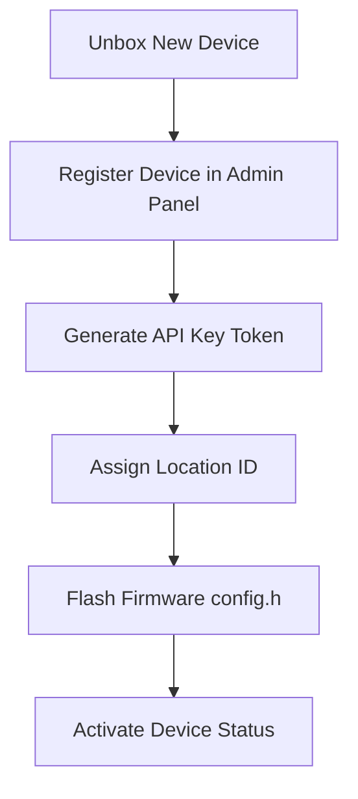

# UroSense Device Provisioning Guide

This guide describes the standard operational procedure for provisioning, registering, and activating new UroSense hardware units.

---

## Provisioning Workflow



### 1. Register Device
Create a record for the new hardware node in the system.
- Endpoint: `/api/device/register`
- Parameters required:
  - `deviceCode`: Unique code identifier (e.g., `US-NOD-1005`)
  - `locationId`: Location UUID (optional during registration, can be assigned later)
  - `firmwareVersion`: Installed firmware version (default: `v1.0.0`)

### 2. Generate API Key Token
During registration, the backend automatically generates a secure unique API key:
- Format: `uro_key_<hex_string>`
- Stored securely in the `device_api_keys` table.
- **IMPORTANT**: The API key is only returned once upon initial registration. Copy and secure the token immediately.

### 3. Flash config.h Configuration
Modify `firmware/esp32/config.h` with the credentials generated:
```cpp
#define DEVICE_ID "US-NOD-1005"
#define DEVICE_API_KEY "uro_key_usnod1005_abcdef"
#define WIFI_SSID "YOUR_SSID"
#define WIFI_PASSWORD "YOUR_PASSWORD"
#define BACKEND_API_URL "http://<SERVER_IP>:3001/api/device/upload"
```

### 4. Assign Location & Activation
In the admin workspace, update the device profile:
- Assign the physical installation location using `assigned_location_id`.
- Update the status column to `online`.
- The device is now active and ready to stream real-time telemetry!
